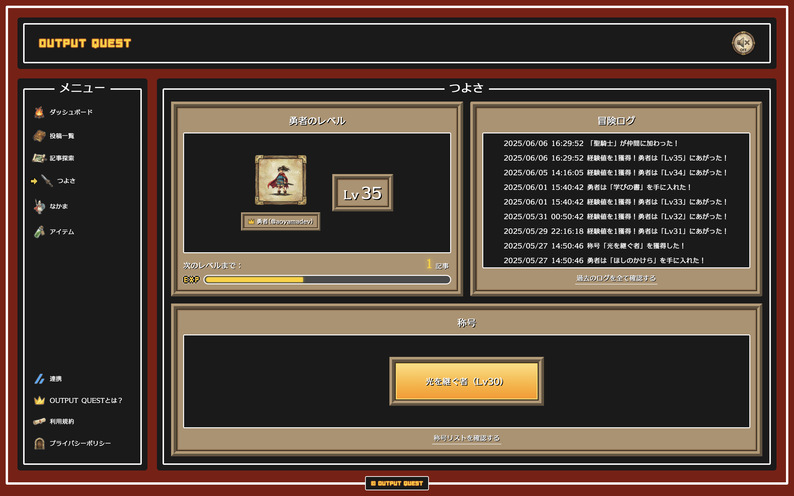
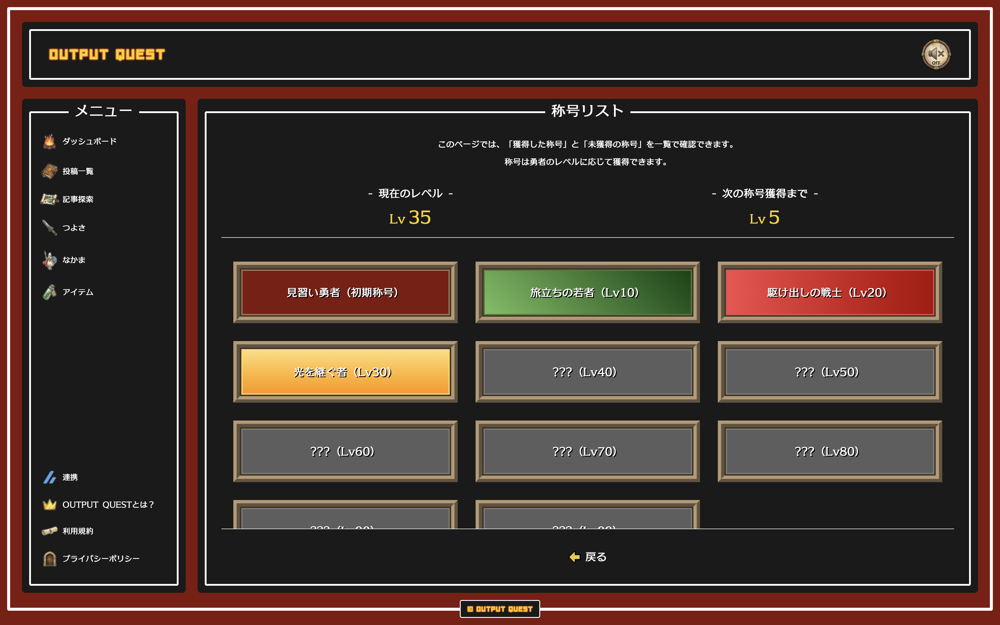
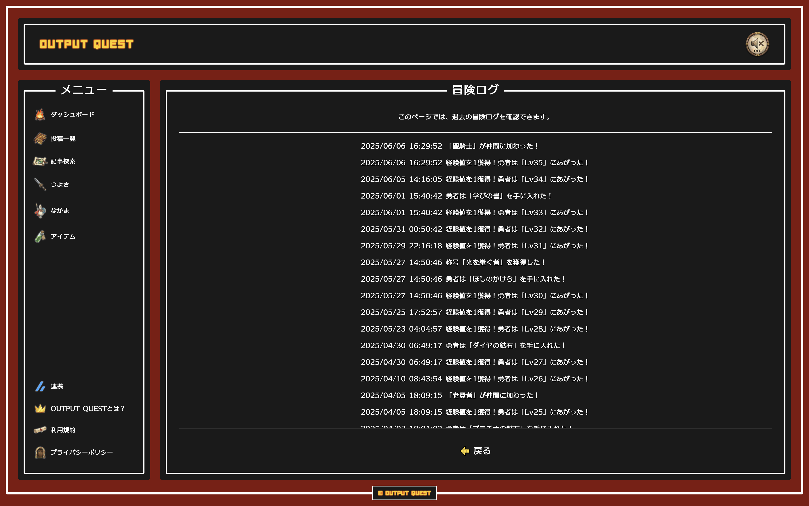
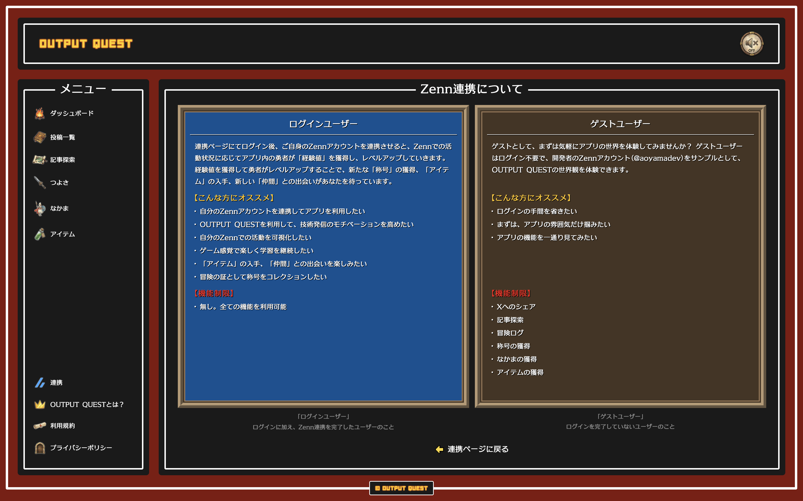

# OUTPUT QUEST　叡智の継承者


Webアプリは以下からアクセスできます。

https://outputquest.com

## 目次

- [コンセプト](#concept)
- [プロジェクト概要](#project-overview)
- [アプリの利用方法](#how-to-use)
- [機能紹介](#feature-introduction)
- [使用技術](#technology-used)
- [技術選定理由](#why-technology-choices)
- [開発構成図](#development-configuration-diagram)
- [ディレクトリ構造](#directory-design)
- [環境構築の手順](#environment-setup-procedure)
- [今後追加予定の機能やアップデート](#future-features-and-updates)

<h2 id="concept">コンセプト</h2>

> ### "アウトプットを学びの冒険に変える。RPG風学習支援Webアプリ"

<h2 id="project-overview">プロジェクト概要</h2>

「OUTPUT QUEST 叡智の継承者」は、Zennで記事を投稿し、勇者を成長させていく**RPG風学習支援Webアプリ**です。ゲーミフィケーション要素がアウトプットという行為を「**学びの冒険**」という体験に変え、学習の継続をサポートします。学ぶ楽しさと理解が深まる達成感をユーザーに届け、**"人生の幸福度を高める体験価値"** を提供したい。そんな想いを込めて開発しました。

Next.js + Tailwind CSS + TypeScriptで開発し、Vercelにデプロイしています。

### 核となる **"3つの価値"**

1. **アウトプットを "学びの冒険" へ**

   Zennで技術記事を書くと、あなたの分身である勇者がレベルアップします。「称号」や「アイテム」の獲得、「仲間」との出会い...。数々のゲーミフィケーション要素が、日々の地道なアウトプットをワクワクする **"学びの冒険"** へと変えます。楽しみながら学習を継続し、知識と理解を深める壮大な旅へとあなたを導きます。

2. **成長の可視化**

   あなたが積み重ねてきた学びの軌跡を、**"冒険ログ"** として自動で記録します。過去の自分が歩んできた道筋を振り返ることは、確かな成長の実感と自信に繋がり、次なる挑戦への原動力となります。

3. **次の学びの冒険へ**

   AIが仲間の賢者として、あなたのZennの過去の投稿を分析し、次に書く記事に最適なテーマを提案します。賢者（AI）はあなたの成長に最適な **"学びのタネ"** を見つけ出し、新たな知的好奇心を刺激します。何を書くか迷った時、賢者はきっとあなたの道標となってくれるでしょう。

### "叡智の継承者"

サブタイトルの「**叡智の継承者**」は、先人の知識を受け継ぎ、自らの言葉で新たな価値を生み出す学習者の姿を表しています。「**一人一人のアウトプットが誰かの道しるべとなり、やがて時代を超える叡智として継承されていく...**」そんな願いと、全ての学習者への敬意を込めております。

<h2 id="how-to-use">アプリの利用方法</h2>

### ゲストユーザーで利用する場合

```bash
# 1. 早速、冒険をはじめよう！
ゲストユーザーは、開発者のZennアカウント「@aoyamadev」と連携済みの状態で利用できるため、すぐに OUTPUT QUEST の世界を体験できます！
```

### ログインユーザーで利用する場合

```bash
# 1. Clerkによるログイン
連携ページ（/connection）にて、ログインを実行。

# 2. Zennのアカウントと連携
ログイン完了後、連携したい自分のZennアカウントのユーザー名を入力して、連携。

# 3. 冒険をはじめよう！
ログインとZennアカウントの連携が完了したら、早速冒険をはじめよう！
```

<h2 id="feature-introduction">機能紹介</h2>

「OUTPUT QUEST　叡智の継承者」の各ページの機能について紹介します。

### **トップページ**

ゲームやアニメのオープニングを彷彿とさせる演出により、"冒険の始まり" を視覚的に表現しております。


### **ダッシュボード**

学びの冒険の拠点となるダッシュボード。 現在の勇者のレベルやZennの投稿数、これまでに集めたアイテムや仲間たちを一目で確認でき、Xへシェアすることも可能です。


### **投稿一覧**

Zennで投稿した記事が一覧表示され、学びの記録として振り返ることができます。記事はカード型UIで表示され、クリックすることでZennの記事ページにアクセスできます。


### **記事探索**

ボタン一つでAI（賢者）があなたのZennの過去記事を解析し、次に執筆すべきおすすめのテーマや方向性を提案します。提案されたアイデアは次のアウトプットの構想を練る強力なヒントになるはずです。


**※記事探索機能には、「Gemini 3 Flash Preview（無料枠）」をAPIとして利用しています。** <br />

Gemini 3 Flash Preview（無料枠）の採用理由は以下の2点です。

- OUTPUT QUESTは、あくまで「**ポートフォリオ用に開発したWebアプリ**」であり、想定利用者は面接官や自分自身に限定されるため無料枠で十分と判断
- **執筆や文字数を出すコンテンツ制作（記事探索機能）** において、Geminiの「**1Mコンテキストウィンドウ**」が非常に役立つため

[Gemini 3 Flash Preview（無料枠）のレートリミット](https://ai.google.dev/gemini-api/docs/rate-limits?hl=ja&_gl=1*ya4rpo*_up*MQ..*_ga*MTY1MTczOTQ5OS4xNzU0NzIyMTI0*_ga_P1DBVKWT6V*czE3NTQ3MjIxMjMkbzEkZzAkdDE3NTQ3MjIxMjMkajYwJGwwJGg3MDA2OTUzNDY.)

| 指標 | 説明                          | 制限値  |
| ---- | ----------------------------- | ------- |
| RPM  | 1分あたりのリクエスト数       | 5       |
| TPM  | 1分あたりのトークン数（入力） | 250,000 |
| RPD  | 1日あたりのリクエスト数       | 100     |

### **つよさ**

勇者の現在のステータスを確認できます。勇者の現在のレベルや獲得した「称号」、これまでの成長過程が刻まれた「冒険ログ」を見返すことができます。



### **称号リスト**

勇者がレベルアップ報酬で獲得した称号を一覧で確認できます。



### **冒険ログ**

これまでの学びの軌跡を時系列で確認できます。



### **なかま**

勇者の仲間に加わったキャラクターを確認できます。一人一人のキャラクターの詳細情報も確認できます。


### **アイテム**

勇者がレベルアップ報酬で入手したアイテムを確認できます。一つ一つのアイテムの詳細情報も確認できます。


### **連携**

Clerk認証によるログイン、Zennのアカウント連携を管理できます。ログインとZenn連携をすることで、Zennの投稿データがアプリ内のUIに反映されます。アプリはログイン無し（ゲストユーザー）でも一部の機能を体験できます。


### **Zenn連携について**

Zenn連携をしてアプリの全機能を活用するメリットや、ゲストユーザーとしてアプリを手軽に体験する方法について解説します。自分に合った方法でOUTPUT QUESTの世界を体験できます。



### **OUTPUT QUESTとは ?**

OUTPUT QUESTの世界観と使い方、アウトプットを通じて成長する「RPG風学習支援Webアプリ」の始め方を解説します。アプリの概要、コンセプト、主要機能について紹介しております。


### **利用規約**

OUTPUT QUESTの利用規約を確認できます。


### **プライバシーポリシー**

OUTPUT QUESTのプライバシーポリシーを確認できます。


<h2 id="technology-used">使用技術</h2>

               

### nodeバージョン

- [node](https://nodejs.org/ja/)：v24.8.0
- [pnpm](https://pnpm.io/ja/)：v10.11.1

### フロント

- [Next.js(App Router)](https://nextjs.org)：v16.1.0
- [React](https://react.dev)：v19.2.3
- [TypeScript](https://www.typescriptlang.org/)：v5.9.3

### スタイル・UI

- [Tailwind CSS](https://tailwindcss.com/)：v4.1.16
- [shadcn/ui](https://ui.shadcn.com/)

### アニメーション

- [Motion](https://motion.dev/)：v12.23.24

### オーディオ

- [Howler.js](https://howlerjs.com/)：v2.2.4

### 認証・データベース

- [Clerk](https://clerk.com/)：v6.36.5（認証）
- [Prisma](https://www.prisma.io/)：v6.18.0（ORM）
- [Supabase](https://supabase.com/)（PostgreSQL）

### スキーマバリデーション

- [zod](https://zod.dev/)：v4.1.12

### AI

- [Vercel AI SDK](https://ai-sdk.dev/)：v5.0.78（TypeScript Toolkit）
- [AI SDK Core](https://ai-sdk.dev/docs/ai-sdk-core/overview)：v2.0.23（LLM：Gemini(gemini-2.5-pro)）
- [AI SDK UI](https://ai-sdk.dev/docs/ai-sdk-ui/overview)：v2.0.78（UI）

### Markdown

- [react-markdown](https://github.com/remarkjs/react-markdown)：v10.1.0

### デプロイ/ホスティング

- [Vercel](https://vercel.com/)

<h2 id="why-technology-choices">技術選定理由</h2>

### Next.js（App Router）

**パフォーマンスとユーザー体験の最適化**

- データフェッチ（拡張fetch＋RSC）により、キャッシュ制御・static rendering/dynamic renderingの切替・即時反映を最適化
- キャッシュ戦略（Data Cache/Router Cache/Full Route Cache）とPrefetchにより、初回表示・ページ遷移・再訪問を高速化し、UXを向上
- 複数のレンダリングモデル（SSG/ISR/Streaming SSR/PPR）で用途別に最適化
- Image/Font最適化、メタデータAPI、動的OGP生成によるSEO強化

### Tailwind CSS + CSS Modules

**Tailwind CSS**

- ユーティリティでレイアウト・余白・レスポンシブを高速化し、一貫性を維持
- shadcn/ui と親和性が高く、コンポーネント拡張が容易

**CSS Modules**

- ローカルスコープでクラス競合を防ぎ、BEM不要で保守性を確保
- Grid/カスタムプロパティ/状態クラスなど複雑なスタイルを明確に分離・管理
- スタイル量の多い箇所はCSSを分離し、可読性・再利用性を向上

### TypeScript

**型安全性と開発効率の向上**

- 静的型付けでエラーを早期発見し、バグを削減
- 型駆動リファクタリングと強力な補完で開発速度を向上
- Prisma/zodと併用し、API・DB・UI間の型整合性を担保

### Vercel（デプロイ/ホスティング）

**Next.jsとの最適な統合**

- Next.js開発元によるサポートあり。VercelはNext.jsをホスティングする環境として開発されており、Next.jsのサーバーサイド機能を特別なセットアップなしに利用可能
- ゼロコンフィグでGitHubリポジトリと連携をするだけで簡単にデプロイ環境を構築可能
- プルリク単位で自動でプレビュー環境を利用可能
- JavaScriptやCSSファイルを自動で圧縮してCDN環境で配信

### その他

**主要ライブラリ選定理由**

- **Clerk**：安全な認証基盤とUIキットで実装を迅速化、ミドルウェア連携も容易
- **Supabase + Prisma**：型安全ORM＋Postgres運用、RLSやリアルタイムを活用可能
- **shadcn/ui**：Tailwind親和のヘッドレス/実装例で、拡張しやすくデザイン整合も保てる
- **Motion**：宣言的アニメーションと良好なパフォーマンスで演出/インタラクションを強化
- **Vercel AI SDK**：LLM呼び出しとストリーミングUIを簡素化、型安全な呼び出しが可能
- **zod**：サーバ/クライアントで同一スキーマを共有し、バリデーションと型を一元化
- **Lucide React**：軽量で揃ったスタイルのアイコン群、ツリーシェイキングで配信最適化

<h2 id="development-configuration-diagram">開発構成図</h2>

[開発構成図](https://camoneart.github.io/outputquest-development-configuration-diagram/)はHTMLインフォグラフィックで表現しました。

<h2 id="directory-design">ディレクトリ構造</h2>

```
outputquest/
├── .clerk/                                          # Clerk 認証設定
├── .claude/                                         # Claude Code設定
├── .cursor/                                         # Cursor Rules
├── .serena/                                         # Serena MCP
├── .vscode/                                         # VS Code 設定
├── .next/                                           # Next.jsビルド・キャッシュファイル
├── prisma/                                          # データベース関連ファイル
│   └── migrations/                                  # マイグレーションファイル
├── public/                                          # 静的ファイル
│   ├── audio/                                       # 音声ファイル
│   ├── gifs/                                        # アニメーション画像ファイル
│   ├── images/                                      # 画像ファイル
│   │   ├── arrow/                                   # 矢印画像
│   │   ├── button/                                  # ボタン画像
│   │   ├── card/                                    # カード画像
│   │   ├── common/                                  # 共通画像
│   │   ├── connection/                              # Zenn連携情報用画像
│   │   ├── crown/                                   # 王冠画像
│   │   ├── hero/                                    # 勇者画像
│   │   ├── icon/                                    # アイコン類
│   │   ├── items-page/                              # アイテムページ用画像
│   │   ├── nav-icon/                                # ナビゲーションアイコン
│   │   ├── opengraph/                               # OGP用画像
│   │   ├── party-page/                              # なかまページ用画像
│   │   ├── plate/                                   # プレート画像
│   │   ├── readme/                                  # README用画像
│   │   ├── sns/                                     # SNSアイコン用画像
│   │   └── top-bg/                                  # トップページ背景用画像
│   └── videos/                                      # 動画ファイル
├── src/
│   ├── app/                                         # ルートディレクトリ（ルーティング管理）
│   │   ├── (main)/                                  # メイン（Route Groups）
│   │   │   ├── about/                               # アバウトページ
│   │   │   ├── connection/                          # Clerk認証・Zenn連携ページ
│   │   │   ├── connection-detail/                   # Clerk認証・Zenn連携の解説ページ
│   │   │   ├── dashboard/                           # ダッシュボードページ
│   │   │   ├── explore/                             # 記事探索ページ
│   │   │   ├── items/                               # アイテムページ
│   │   │   ├── logs/                                # ログページ
│   │   │   ├── party/                               # なかまページ
│   │   │   ├── posts/                               # 投稿ページ
│   │   │   ├── privacy/                             # プライバシーポリシーページ
│   │   │   ├── strength/                            # つよさページ
│   │   │   ├── terms/                               # 利用規約ページ
│   │   │   ├── title/                               # 称号ページ
│   │   │   ├── layout.tsx                           # メイン（Route Groups）用レイアウトコンポーネント
│   │   │   └── MainLayout.module.css                # メイン（Route Groups）用CSS Modules
│   │   ├── api/                                     # API Routes
│   │   │   ├── ai/                                  # AI(LLM)関連API
│   │   │   ├── user/                                # ユーザー関連API
│   │   │   ├── webhooks/                            # Webhook
│   │   │   └── zenn/                                # Zenn連携API
│   │   ├── favicon.ico                              # ファビコン
│   │   ├── Home.module.css                          # トップページ用CSS Modules
│   │   ├── layout.tsx                               # アプリケーション全体のルートレイアウトコンポーネント
│   │   ├── page.tsx                                 # ルートページ（トップページ）
│   │   ├── robots.ts                                # 検索エンジン向けrobots.txt生成
│   │   └── sitemap.ts                               # サイトマップ生成ファイル
│   ├── components/                                  # 再利用可能なUIコンポーネント
│   │   ├── auth/                                    # 認証関連コンポーネント
│   │   ├── common/                                  # 共通コンポーネント
│   │   ├── elements/                                # 基本的なUI要素
│   │   ├── layout/                                  # レイアウトコンポーネント
│   │   └── ui/                                      # shadcn/ui コンポーネント
│   ├── config/                                      # 環境・挙動を制御する設定 (環境変数, サービス URL, 機能フラグ等) ※環境ごとに値が変わる可能性あり
│   ├── consts/                                      # 不変定数 (enum, アイコン/色/文言マッピング, サイト情報, ページサイズなど) ※全環境共通
│   ├── contexts/                                    # React Context・グローバル状態管理
│   ├── features/                                    # componentsでは共通化が難しい、特定の機能やドメイン固有のコンポーネントを管理するディレクトリ
│   │   ├── about/                                   # Aboutページ機能
│   │   ├── connection/                              # Clerk認証・Zenn連携ページ機能
│   │   ├── connection-detail/                       # Clerk認証・Zenn連携の解説ページ機能
│   │   ├── dashboard/                               # ダッシュボード機能
│   │   ├── explore/                                 # 記事探索ページ機能
│   │   ├── gnav/                                    # グローバルナビゲーション機能
│   │   ├── hero/                                    # ヒーローセクション機能
│   │   ├── home/                                    # ホームページ機能
│   │   ├── item-detail/                             # アイテム詳細機能
│   │   ├── items/                                   # アイテム機能
│   │   ├── logs/                                    # ログ機能
│   │   ├── main/                                    # メイン機能
│   │   ├── navigation/                              # ナビゲーション機能
│   │   ├── party/                                   # なかま機能
│   │   ├── party-member/                            # なかま詳細機能
│   │   ├── posts/                                   # 投稿機能
│   │   ├── strength/                                # つよさ機能
│   │   ├── title/                                   # 称号機能
│   │   ├── user/                                    # ユーザー機能
│   │   └── zenn/                                    # Zenn機能
│   ├── generated/                                   # Prisma Clientなど自動生成されるファイル
│   ├── hooks/                                       # カスタムフック
│   ├── lib/                                         # ライブラリ・ユーティリティ
│   ├── shared/                                      # 共有データ
│   ├── styles/                                      # スタイルファイル(globals.css)
│   ├── types/                                       # TypeScript型定義
│   ├── utils/                                       # ユーティリティ関数
│   └── proxy.ts                                     # ミドルウェアロジック
├── .depcheckrc.json                                 # 依存関係チェックツール depcheck の設定ファイル
├── .env                                             # 環境変数の設定ファイル
├── .env.example                                     # 環境変数のテンプレートファイル
├── .gitignore                                       # GitHubの差分に含まないものを格納
├── .mcp.json                                        # MCP設定ファイル
├── .npmrc                                           # pnpmの設定ファイル
├── .prettierrc.json                                 # Prettierの設定ファイル
├── components.json                                  # shadcn/ui設定ファイル
├── eslint.config.mjs                                # ESLint設定ファイル
├── next-env.d.ts                                    # Next.js の型定義補完ファイル（自動生成）
├── next.config.ts                                   # Next.js設定ファイル
├── package.json                                     # プロジェクトの依存関係・スクリプト定義
├── pnpm-lock.yaml                                   # pnpmの依存関係ロックファイル
├── postcss.config.mjs                               # PostCSS設定ファイル
├── README.md                                        # プロジェクトの説明ドキュメント
└── tsconfig.json                                    # TypeScript設定ファイル
```

<h2 id="environment-setup-procedure">環境構築の手順</h2>

### 前提条件

- Node.js 20.9.0 以上
- pnpm
- Git

### 1. リポジトリのクローン

```bash
git clone https://github.com/camoneart/output-quest.git
cd output-quest
```

### 2. パッケージのインストール

```bash
$ pnpm install
```

### 3. 環境変数の設定

```bash
# `.env.example`を参考に`.env`ファイルを作成し、必要な環境変数を設定してください。
$ cp .env.example .env
```

### 4. データベースのセットアップ

```bash
# Prismaクライアントの生成
npx prisma generate

# マイグレーションの実行
npx prisma migrate dev
```

### 5. 開発サーバーの起動（ローカル環境の立ち上げ）

```bash
$ pnpm dev
```

下記のローカル環境にアクセスして、アプリケーションの起動が確認できれば OK です。<br>
http://localhost:3000/<br>

<h2 id="future-features">今後追加予定の機能やアップデート</h2>

### **記事探索機能のアップデート**

- LLMのモデル変更（現在：gemini-3-flash-preview）
- モデルの回答生成時の口調の変更（現在：老賢者）

### **連携できるプラットフォームの追加**

- 現在：[Zenn](https://zenn.dev) のみ
- 追加予定：[note](https://note.com), [Qiita](https://qiita.com), [izanami](https://izanami.dev)

### **冒頭ログのアップデート**

- 表示ログの種類を拡張

### **アプリ内で入手できる報酬の追加**

- 新アイテム、新称号、新キャラ（なかま）の追加

### **勇者のレベル上限の拡張**

- 現在の上限：Lv99

### **主人公の変更機能を追加**

- 現在は勇者のみ（変更不可）
- 主人公に設定できるキャラを、「勇者のなかま」から選択できるように
